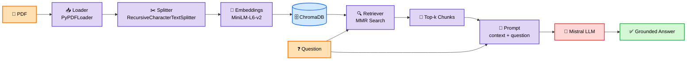
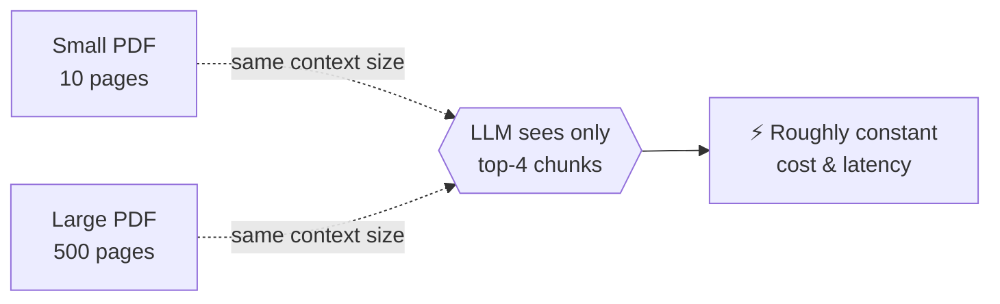

<div align="center">

# 🎬 GenAI Projects
### A growing collection of mini projects exploring LangChain & Generative AI


</div>

<div align="center">

### 📖 Quick Navigation

[🤖 ChatBot](#-chatbot) · [🍿 CineParse](#-cineparse) · [📄 DocQuery](#-docquery--chat-with-your-pdfs-rag) · [⚙️ Setup](#️-getting-started) · [🛠️ Stack](#️-built-with)

</div>

---

# 📂 Projects

## 🤖 ChatBot — Personality-Driven Conversations

<div align="center">


**A CLI + Streamlit chatbot that stays fully in-character across an entire conversation — pick a personality and watch the LLM commit to it.**

</div>

<br>

A simple chatbot built with LangChain and Gemini that role-plays a chosen personality throughout the conversation.

| 😠 Angry | 😄 Happy | 😢 Sad | 😏 Rude |
|:---:|:---:|:---:|:---:|
| Snappy, short-tempered replies | Upbeat, enthusiastic replies | Gloomy, low-energy replies | Sarcastic, blunt replies |

- The personality is injected as a `SystemMessage`, so the AI stays in character for every reply
- Full conversation history is maintained using `HumanMessage` / `AIMessage`, so the bot remembers context across turns
- Streamlit version adds a chat-style UI with message bubbles, a sidebar to pick/reset personality, and a "Start Chat" flow

**Files**

| File | Description |
|---|---|
| `core.py` | CLI version |
| `ui.py` | Streamlit UI |

**Run**

```bash
streamlit run ChatBot/ui.py
```

---

## 🍿 CineParse — Movie Info Extraction

<div align="center">


**Feed it a free-text paragraph about one or more movies — get back clean, structured details with no hallucinated fields.**

</div>

<br>

An information-extraction tool that reads a free-text paragraph about one or more movies and pulls out the key details:

`🎬 Title` &nbsp;`📅 Year` &nbsp;`🎭 Genre` &nbsp;`🎥 Director` &nbsp;`👥 Cast` &nbsp;`⭐ Rating` &nbsp;`📝 Plot` &nbsp;`🗣️ Language` &nbsp;`💰 Box Office` &nbsp;`🏆 Awards`

- Handles paragraphs describing **multiple movies at once**, extracting each one separately
- Skips fields that aren't mentioned instead of guessing or hallucinating (`null` / empty list instead of made-up data)

| Mode | Output | Powered By |
|---|---|---|
| 📝 **Text mode** | Clean, human-readable Markdown summary | `ChatPromptTemplate` |
| 🧬 **Structured mode** | Validated JSON, ready for other apps/APIs | `Pydantic` + `PydanticOutputParser` |

- Streamlit UI includes a "Load Sample Paragraph" button for quick testing and a toggle to view raw JSON output

**Files**

| File | Description |
|---|---|
| `text_extractor.py` | CLI — Markdown output |
| `text_extractor_ui.py` | Streamlit UI |
| `structured_extractor.py` | CLI — JSON (Pydantic) |
| `structured_extractor_ui.py` | Streamlit UI |

**Run**

```bash
streamlit run CineParse/structured_extractor_ui.py
```

---

## 📄 DocQuery — Chat with Your PDFs (RAG)

<div align="center">


**A Retrieval-Augmented Generation system that lets you upload a PDF and ask natural-language questions about it — answered *only* from the document, never hallucinated.**

</div>

> 🧠 **The core idea:** An LLM only knows what it was trained on and has zero memory of *your* PDF. RAG fixes that by finding the most relevant slices of your document at question-time and handing them to the LLM as context, so the answer is grounded in *your* content instead of the model's guesswork.

This is the most involved project in the repo, touching every stage of a real RAG pipeline — loading, chunking, embedding, storing, retrieving, and generating.

<br>

#### 🔄 End-to-End Pipeline



<br>

#### 🧩 Pipeline Stages — Click to Expand

<details>
<summary><b>1️⃣ Document Loaders</b> — turning a file into text LangChain can use</summary>
<br>

Loaders pull raw content out of a file and convert it into LangChain `Document` objects (text + metadata like page number/source). DocQuery uses `PyPDFLoader`, but LangChain ships loaders for most formats:

| Loader | 📎 Use Case |
|---|---|
| 🔴 `PyPDFLoader` | Single PDF files — loads page-by-page with page-number metadata |
| 📃 `TextLoader` | Plain `.txt` files |
| 📊 `CSVLoader` | Tabular data — one `Document` per row |
| 📁 `DirectoryLoader` | Bulk-loads every file in a folder using another loader under the hood |
| 🌐 `WebBaseLoader` | Scrapes and loads content directly from a URL |
| 🗂️ `UnstructuredFileLoader` | Mixed formats — docx, pptx, html — via the `unstructured` library |

> 💡 The loader you pick decides what metadata survives (e.g. page numbers), which shapes how useful your citations/context can be later.

</details>

<details>
<summary><b>2️⃣ Text Splitters</b> — breaking documents into digestible chunks</summary>
<br>

LLMs and embedding models have context limits, and one giant chunk destroys retrieval precision. DocQuery uses `RecursiveCharacterTextSplitter`, which splits on natural boundaries (paragraphs → sentences → words) before falling back to a hard cut — keeping chunks coherent instead of sliced mid-sentence.

```python
chunk_size = 1000      # max characters per chunk
chunk_overlap = 200    # overlap so context isn't lost at chunk boundaries
```

| Splitter | 🎯 Best For |
|---|---|
| ✂️ `RecursiveCharacterTextSplitter` | **(used here)** general-purpose, respects natural text structure |
| 🔤 `CharacterTextSplitter` | Splits on one fixed separator only, no fallback |
| 🔢 `TokenTextSplitter` | Splits by token count — precise LLM context-limit control |
| 🧠 `SemanticChunker` | Splits where *meaning* shifts, using embeddings instead of a fixed size |

</details>

<details>
<summary><b>3️⃣ Vector Store</b> — embeddings + ChromaDB</summary>
<br>

Each chunk becomes a high-dimensional vector via `sentence-transformers/all-MiniLM-L6-v2` (`HuggingFaceEmbeddings`) — free, runs entirely locally on CPU, no API key required. Vectors are persisted to disk in **ChromaDB** (`chroma_db/`), so a document only needs to be embedded once.

> 💡 Semantically similar text ends up close together in vector space — that's what lets a question match an answer even when they don't share the same exact words.

</details>

<details>
<summary><b>4️⃣ Retrievers</b> — deciding which chunks answer the question</summary>
<br>

| Strategy | ⚙️ How It Works | ⭐ Best For |
|---|---|---|
| 🎯 **Similarity Search** | Top-`k` chunks by highest cosine similarity | Simple, fast, default baseline |
| 🌈 **MMR** *(used here)* | Fetches a wide candidate pool, then re-ranks for relevance **+** diversity | Avoids 4 near-duplicate chunks; better coverage of long docs |
| 🚧 **Similarity Score Threshold** | Like similarity search, but drops chunks below a min score | Prevents forcing irrelevant chunks when the doc truly lacks the answer |
| 🔀 **Multi-Query Retriever** | LLM rewrites the question several ways, retrieves for each, merges results | Boosts recall when phrasing may not match the doc's wording |
| 🧹 **Contextual Compression** | Retrieves normally, then strips irrelevant sentences from each chunk | Cuts noise from long or loosely-relevant chunks |

**DocQuery's exact config:**
```python
search_type = "mmr"
search_kwargs = {
    "k": 4,             # final chunks returned
    "fetch_k": 10,       # candidate pool MMR picks from
    "lambda_mult": 0.5   # 0 = max diversity ↔ 1 = max relevance
}
```

</details>

<details>
<summary><b>5️⃣ Generation</b> — turning chunks into a real answer</summary>
<br>

Retrieved chunks are joined into a context string and slotted into a `ChatPromptTemplate` with the user's question. The system prompt **forces** the model to answer only from that context, and to reply *"I could not find the answer in the document"* when it isn't there — this single constraint is what stops hallucination. The final prompt goes to **Mistral** (`ChatMistralAI`) for the natural-language answer.

</details>

<br>

#### 📈 Scaling to Large PDFs



Because chunking + embedding happens **once** during ingestion, DocQuery never sends the whole PDF to the LLM — only the top handful of relevant chunks per question, regardless of whether the source is 10 pages or 500. The tradeoff: retrieval quality (splitter, chunk size, retriever choice) matters more, since the LLM never gets a second look at anything that wasn't retrieved.

<br>

#### 📁 Files

| File | Description |
|---|---|
| ⚙️ `ingest.py` | Loads a PDF, splits it into chunks, embeds them, persists to `chroma_db/` |
| 💬 `query.py` | CLI — loads the persisted vectorstore, answers questions in a terminal loop |
| 🖥️ `app.py` | Streamlit UI — upload a PDF, process it, and chat with it in a browser |

#### ▶️ Run

```bash
# CLI: ingest once, then query
python DocQuery/ingest.py
python DocQuery/query.py

# Or the Streamlit UI (upload + chat in one app)
streamlit run DocQuery/app.py
```

---

## ⚙️ Getting Started

### 1️⃣ Clone the repo
```bash
git clone https://github.com/harshhere905/genai-projects-.git
cd genai-projects-
```

### 2️⃣ Create a virtual environment *(optional but recommended)*
```bash
python -m venv .venv
.venv\Scripts\activate      # Windows
source .venv/bin/activate   # macOS/Linux
```

### 3️⃣ Install dependencies
```bash
pip install -r requirements.txt
```

### 4️⃣ Add your API keys
Create a `.env` file in the root folder:
```env
GOOGLE_API_KEY=your_google_api_key_here
MISTRAL_API_KEY=your_mistral_api_key_here
```

| Key | Where to get it | Used by |
|---|---|---|
| 🔑 `GOOGLE_API_KEY` | [Google AI Studio](https://aistudio.google.com/apikey) | ChatBot, CineParse |
| 🔑 `MISTRAL_API_KEY` | [Mistral AI Console](https://console.mistral.ai/) | DocQuery |

> 💡 `sentence-transformers/all-MiniLM-L6-v2` (used for DocQuery's embeddings) runs fully locally — no HuggingFace API key needed.

### 5️⃣ Run any project 🚀
Use the run command listed in each project's section above.

---

## 🛠️ Built With

| Tool | Purpose |
|---|---|
| 🦜🔗 **LangChain** | LLM orchestration, chains, prompts, retrievers |
| ✨ **Google Gemini** | Language model (gemini-2.5-flash) — ChatBot, CineParse |
| 🌬️ **Mistral AI** | Language model — DocQuery |
| 🤗 **HuggingFace Embeddings** | Local, free text embeddings (all-MiniLM-L6-v2) — DocQuery |
| 🎨 **ChromaDB** | Vector database for storing & retrieving document embeddings — DocQuery |
| 🎈 **Streamlit** | Interactive UI |
| 📦 **Pydantic** | Structured output validation |

---

<div align="center">

### 📌 More mini projects coming soon as the learning continues!

⭐ *If you find this useful, consider giving it a star!*

</div>
